# CyberTeam-Inspired Task DAG

This DAG is hardcoded from the CyberTeam embodied threat-hunting workflow idea:
upstream analytical outputs are passed to dependent downstream tasks, while tasks
in the same broad phase can remain independent when they address distinct evidence.

The coordinator selects hunting objectives. The orchestrator expands the selected
tasks with required dependencies, topologically sorts the graph, and passes verified
upstream outputs into each downstream task.

## Dependency Table

| Task | Name | Depends on |
| --- | --- | --- |
| T1 | Malware Identification | none |
| T2 | Signature Matching | T1 |
| T3 | Temporal Pattern Matching | none |
| T4 | Affiliation Linking | T1, T7 |
| T5 | Geographic Analysis | T1, T7 |
| T6 | Victimology Profiling | T1, T7 |
| T7 | Infrastructure Extraction | none |
| T8 | Actor Identification | T1, T2, T4, T7 |
| T9 | Campaign Correlation | T1, T2, T7, T8 |
| T10 | File System Activity Detection | T7 |
| T11 | Network Behavior Profiling | T7 |
| T12 | Credential Access Detection | T7, T13, T14 |
| T13 | Execution Context Analysis | T7 |
| T14 | Command & Script Analysis | T7, T13 |
| T15 | Privilege Escalation Inference | T12, T13, T14 |
| T16 | Evasion Behavior Detection | T10, T13, T14 |
| T17 | Event Sequence Reconstruction | T10, T11, T12, T13, T14, T16 |
| T18 | TTP Extraction | T2, T7, T10, T11, T12, T13, T14, T16, T17 |
| T19 | Attack Vector Classification | T10, T11, T13, T17, T18 |
| T20 | Attack Complexity Classification | T10, T13, T17, T18 |
| T21 | Privileges Requirement Detection | T12, T13, T15 |
| T22 | User Interaction Categorization | T10, T13, T14 |
| T23 | Attack Scope Detection | T10, T11, T13, T17 |
| T24 | Impact Level Classification | T10, T11, T12, T14, T16, T17 |
| T25 | Severity Scoring | T19, T20, T21, T22, T23, T24 |
| T26 | Playbook Recommendation | T1, T7, T17, T18, T25 |
| T27 | Security Control Adjustment | T7, T16, T18, T25 |
| T28 | Patch Code Generation | T19, T20, T25 |
| T29 | Patch Tool Suggestion | T18, T25 |
| T30 | Advisory Correlation | T1, T8, T18, T25 |

## Mermaid

```mermaid
flowchart TD
    T1["T1: Malware Identification"]
    T2["T2: Signature Matching"]
    T3["T3: Temporal Pattern Matching"]
    T4["T4: Affiliation Linking"]
    T5["T5: Geographic Analysis"]
    T6["T6: Victimology Profiling"]
    T7["T7: Infrastructure Extraction"]
    T8["T8: Actor Identification"]
    T9["T9: Campaign Correlation"]
    T10["T10: File System Activity Detection"]
    T11["T11: Network Behavior Profiling"]
    T12["T12: Credential Access Detection"]
    T13["T13: Execution Context Analysis"]
    T14["T14: Command & Script Analysis"]
    T15["T15: Privilege Escalation Inference"]
    T16["T16: Evasion Behavior Detection"]
    T17["T17: Event Sequence Reconstruction"]
    T18["T18: TTP Extraction"]
    T19["T19: Attack Vector Classification"]
    T20["T20: Attack Complexity Classification"]
    T21["T21: Privileges Requirement Detection"]
    T22["T22: User Interaction Categorization"]
    T23["T23: Attack Scope Detection"]
    T24["T24: Impact Level Classification"]
    T25["T25: Severity Scoring"]
    T26["T26: Playbook Recommendation"]
    T27["T27: Security Control Adjustment"]
    T28["T28: Patch Code Generation"]
    T29["T29: Patch Tool Suggestion"]
    T30["T30: Advisory Correlation"]
    T1 --> T2
    T1 --> T4
    T7 --> T4
    T1 --> T5
    T7 --> T5
    T1 --> T6
    T7 --> T6
    T1 --> T8
    T2 --> T8
    T4 --> T8
    T7 --> T8
    T1 --> T9
    T2 --> T9
    T7 --> T9
    T8 --> T9
    T7 --> T10
    T7 --> T11
    T7 --> T13
    T7 --> T14
    T13 --> T14
    T7 --> T12
    T13 --> T12
    T14 --> T12
    T12 --> T15
    T13 --> T15
    T14 --> T15
    T10 --> T16
    T13 --> T16
    T14 --> T16
    T10 --> T17
    T11 --> T17
    T12 --> T17
    T13 --> T17
    T14 --> T17
    T16 --> T17
    T2 --> T18
    T7 --> T18
    T10 --> T18
    T11 --> T18
    T12 --> T18
    T13 --> T18
    T14 --> T18
    T16 --> T18
    T17 --> T18
    T10 --> T19
    T11 --> T19
    T13 --> T19
    T17 --> T19
    T18 --> T19
    T10 --> T20
    T13 --> T20
    T17 --> T20
    T18 --> T20
    T12 --> T21
    T13 --> T21
    T15 --> T21
    T10 --> T22
    T13 --> T22
    T14 --> T22
    T10 --> T23
    T11 --> T23
    T13 --> T23
    T17 --> T23
    T10 --> T24
    T11 --> T24
    T12 --> T24
    T14 --> T24
    T16 --> T24
    T17 --> T24
    T19 --> T25
    T20 --> T25
    T21 --> T25
    T22 --> T25
    T23 --> T25
    T24 --> T25
    T1 --> T26
    T7 --> T26
    T17 --> T26
    T18 --> T26
    T25 --> T26
    T7 --> T27
    T16 --> T27
    T18 --> T27
    T25 --> T27
    T19 --> T28
    T20 --> T28
    T25 --> T28
    T18 --> T29
    T25 --> T29
    T1 --> T30
    T8 --> T30
    T18 --> T30
    T25 --> T30
```

